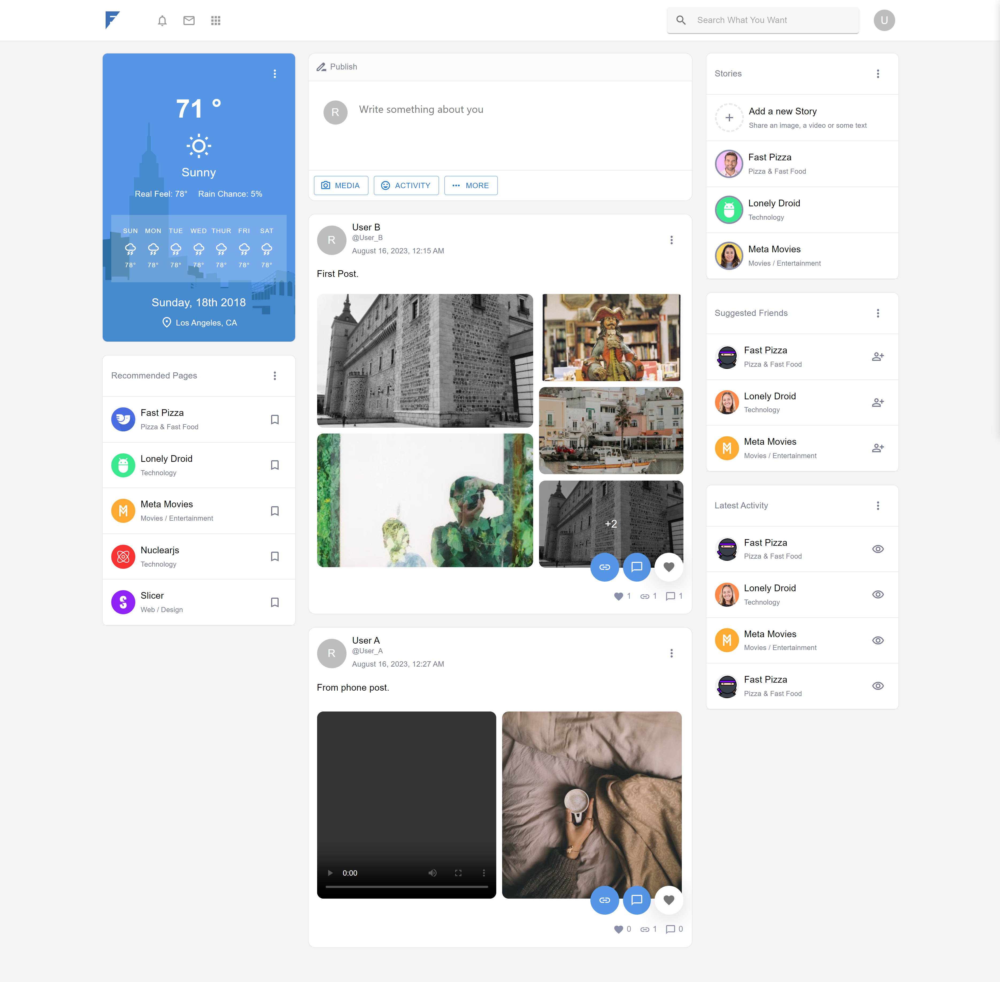

# React Frontend for Social Media Clone

This repository holds the frontend of our social media clone application. Built using the React.js framework, it mirrors familiar features found in mainstream social media platforms with a custom touch. It interacts seamlessly with our Django backend, creating an integrated and interactive experience.



## Key Features:

1. **User Interactivity**:
   - Users can create, edit, and delete posts.
   - Intuitive interfaces for liking posts, adding comments, and replying to comments.
2. **Adaptive Video Playback**:

   - Leveraging the HLS protocol, users can upload and stream videos adaptively. The video quality adjusts automatically based on the viewer's network conditions.

3. **Responsive UI**:
   - A clean and modern design optimized for desktop, tablet, and mobile users.
4. **Real-time Feedback**:
   - Instant notifications and updates after interactions like posting or commenting, giving users a dynamic experience.

## Technology Stack:

- **React.js**: Employs a component-based architecture, ideal for creating modular and reusable UI components.
- **Axios**: For HTTP requests, ensuring effective communication with our Django backend.
- **Yarn**: As the preferred package manager and task runner.
- **Redux (Optional)**: If used, provides efficient state management across React components.

## Getting Started:

1. **Prerequisites**:

   - Ensure Node.js and Yarn are installed.

2. **Installation**:

   ```bash
   # Clone the repository
   git clone <repository-url>

   # Navigate into the project directory
   cd <project-directory-name>

   # Install dependencies via Yarn
   yarn install

   # Launch the development server
   yarn start
   ```

3. **Browser Access**:
   - The app should now be live at `http://localhost:3000`.

## Feedback & Contributions:

Your feedback and contributions to this project are invaluable. Please feel free to open issues or propose changes via pull requests.
